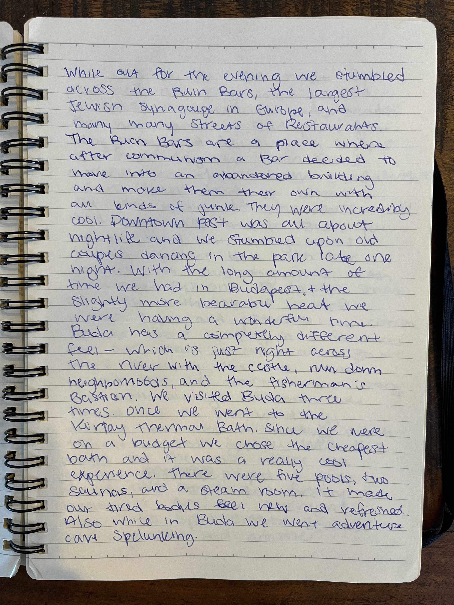
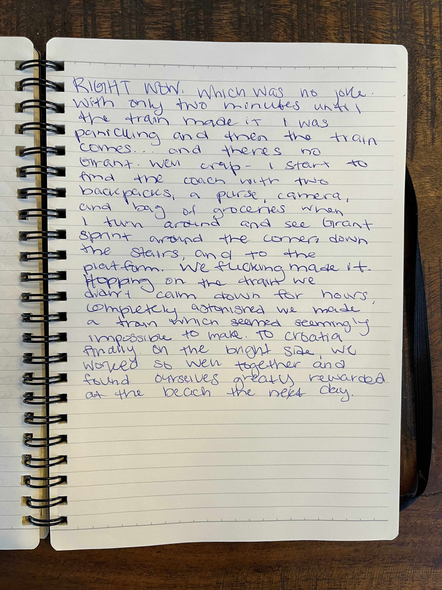

## Budapest, Hungary

Budapest had a feeling of disarray, wildness, and a whole stink'n lot of cigarette smoke. After last minute booking a new AirBnb we got off at the last stop - or the central station of Budapest. Before taking the metro to the place, we stopped by a bathroom. It was to no surprise they made you pay to "maintain" the bathroom you used which was far from maintained. I walked in being forced to pay for toilet paper while Grant continued onward to pee. The man who collects money hollered a very ugly Hungarian "Hallo! Hallo!" (at Grant) and we kept walking. On the way out (of the bathroom) the man followed Grant and said "money, you pay". Grant didn't have any money so he played it off and said to the man "oh money? ATM that way!", and Grant pointed in the other direction. After sufficiently confusing the man enough, Grant managed to pee without paying. On the way to the AirBnb, we had to wait and sit on the ground for about an hour (and had a snack, photo below). Our over priced, totally crappy AirBnb was perfectly located. Soon after, we went to explore Pest.

While out for the evening we stumbled across the "Ruin Bars", the largest Jewish Synagogue in Europe, and many many streets of restaurants. The Ruin Bars are a place after communism fell, a bar decided to move into an abandoned building and make them their own with all kinds of junk. They were incredibly cool. Downtown Pest was all about nightlife and we stumbled upon old couples dancing in the park late one night. With the long amount of time we had in Budapest, the slightly more bearable heat, we were having a wonderful time. "Buda" has a completely different feel - which is just right across the river with the castle, run down neighborhoods, and the Fisherman's Bastion. We visited Buda three times. Once we went to the Thermal Bath. Since we were on a budget, we chose the cheapest bath and it was a really cool experience. There were five pools, two saunas, and a steam room. It made our tired bodies feel new and refreshed. Also, while in Buda we went adventure cave spelunking.

This was by far the most fun part of our stay. We squeezed ourselves into cracks underneath the mountains of Budapest, got very dirty, and found many bruises the next day. We even found ourselves in the "death sandwich" where Grant had to breathe out to move. It was AWESOME!! And our last time in Buda you would find our crazy selves hiking Gellert Hill with our packs on, sweating, and with no water. Brilliant! Budapest served us well with lots of wonderful places, sights, and pistachio ice cream. As we were waiting in the Starbucks for our train to come at 6:30 we were thinking this has been great but we don't have a story we will always remember quite like Poland and so we unwillingly decided to make a mistake which tested us both greatly.

> Note: The rest of this section is re-written from the journal for clarity as this is what Leah and Grant now recall as the **Budapest Incident**!

We leave the coffee shop and go to stop for groceries before heading onto the metro on our way to the main train station in Budapest to catch our overnight train to Split. We got caught up in the grocery store and missed the metro train and realized we were now cutting it a little close. We had four minutes until the next metro came so Leah decided to double check out train tickets. She pulls open her phone and as she does I (Grant) see her face start to go pale. The tickets said that the train left from Kelenfold at 6:30. It was now 6:22 and we were on our way to the wrong train station. In fact, our very train left from the station we were heading too but nearly half an hour before on its way to Kelenfold. We had made a huge mistake and instantly knew why. When we had our original AirBnb cancel, we re-booked right next to the train station we arrived in Budapest at. However, this was not the station we would be departing from when we left Budapest. Leah broke down and started to cry. I gave her a hug and told her it would be okay and we will find a way to catch that train. At the time I was trying to comfort her but had no idea if the words coming out of my mouth were true and it felt like we were hopeless.

We hopped on the next metro train and it took us to the main station even though our train was long gone. We hoped to find someone with answers when we arrived at the station. As soon as the metro doors opened, we sprinted to the information desk - with all our packs on and breaking a sweat instantly. I started franticly explaining to the man at the desk what had happened. He barely spoke any English so we showed him the tickets on Leah's phone. He looked at them and said "its not possible". We turned around from the desk looking at all the LED signs displaying train departures to see if there were any other trains to Split. In this moment we remembered when booking that this was the only overnight train to Split that week. This was the only train and if we didn't make it our entire trip's budget would be blown on a flight to catch up and we had only just begun our trip. I turned back to the desk and asked, "where is the next stop for our train". He said the name of a station but it sounded so foreign to me I couldn't even pronounce what he said. He could tell we didn't understand so he wrote it down on a piece of paper and handed it to us.

> The note we were handed with the station name

To this day, we have no idea what the note really says or how on Earth to pronounce it. I grabbed the note, said "let's go" to Leah and we sprinted outside. We ran down the main steps of the station to see a few taxis parked out front. The taxi drivers were all leaning against the side of the building and sharing a few cigarettes. I lifted up the note and yelled "taxi!". None of them really seemed to eager to take us so I started walking towards them and said "taxi" again in almost a pleading voice. They could probably tell we were in a pinch. One of them stepped forward, shrugged, and stomped out his cigarette. He was a big bald man and looked like he had lived through quite a lot. He said "where" and I handed him the note. He looked at the note and said the exact same thing as the man at the information desk "its not possible". He knew the train we were trying to catch was now two stations ahead of us and we were pretty much out of luck. I don't recall what I said to him but I think I said something along the lines of "we have to get there". He looked at me and said "okay, we try". We through our bags in the trunk and screeched out of the station. He clicked a button on his taxi meter that was probably the "super rush fare" button and he floored it. He went directly into the bus lane and was weaving in and out of cars through the city on our way to the main highway. Had we not been completely full of adrenaline, we probably would have feared for our lives in this taxi.

Now on the highway, we looked at the GPS on his dashboard - it said 40 minutes to the destination. We knew that the train departed the station in about 38 minutes. Even if we made it there exactly on time from what the GPS was stating, we would still miss the train. The driver noticed me looking at the GPS, and he could tell we were cutting it extremely close. He then did something we will never forget. He looked back at us, said "James Bond", reclined his seat, and pressed the pedal straight to the floor. I looked at the speedometer and we were going 115 mph! Our driver was now as determined as us to make that train. I'm not sure of the laws or police in Hungary but I have a feeling that going 115 mph would give you quite the ticket.

Our GPS arrival time kept ticking down minute by minute since we were slowly gaining time on our schedule by greatly exceeding the speed limit. We now had about 8 minutes to spare and a wave of relief started to wash over us. Maybe we *would* make that train after all! This hope didn't last too long though as the driver asked "how you pay?". I realized we had maybe at most 10 euros cash on us. I asked "credit card?", and we got the same classic Hungarian response "its not possible". We looked at each other and thought the exact same thing without even exchanging words... "oh shit"... The train station has to have an ATM right? What train station doesn't have ATMs?

Just as we had screeched out of the train station before, we were now screeching into the Kelenfold station where our train would be arriving any minute. We had actually managed to beat the train to the station. However, it would only stop for at most a few minutes to let people on before leaving for good. Leah and I hop out of the taxi, pop the trunk, and Leah grabs all the bags and groceries. We had agreed that she would take all the packs to the station platform and I would sprint inside to look for an ATM to pay our driver. I sprinted inside like a mad man looking for an ATM. I must have covered about half the station with no success at all. In a panic, I asked a security guard "banko automatico!!!" (ATM) while waving my wallet. He said "no bank automatic here" and my heart just stopped.

I sprinted back out to the taxi and got right back into the passenger seat. The driver was now sitting there smoking a cigarette as he must have been equally stressed after the drive. He asked "money?" and I frantically started looked around for an ATM. He could tell we needed to find one so now we were speeding through the streets of this town looking for a sign for one. We came up to a stop sign and looked down all four cross streets. There was no a single sign of an ATM in sight. I rolled down my window and shouted "banko automatico!?" while waving my wallet at a pedestrian. The woman looked at me and pointed across the street at a small grocery store. In motion, I was out the door of the taxi and flying into the entrance of the grocery store. There was someone walking up to the ATM and saw me in full sprint going towards it with my wallet and they jumped out of the way. The ATM was entirely in Hungarian and so I just shoved my card into the machine, and clicked the largest number on the screen for withdrawal. Watching the bills eject from the machine for about 10 seconds felt like an eternity. Now with cash in hand, and almost forgetting my debit card in the machine, I was full sprint back to the taxi. I slapped what could have been about 200 euros into the driver's hand and he said "thank you!" and we were off.

Sitting in the taxi I was still in full panic mode. "How long did that take?" I thought. Did the train leave? Is Leah now sitting on the platform in despair waiting for me to get back? These thoughts were quickly forced out of my head when I saw the station ahead of us and rapidly approaching as we were certainly doing triple the speed limit again.

There was just one intersection between us and the station now. The light was turning yellow and the driver hit the gas, hard. Out of driver side window I saw another car doing the same thing. Both cars slammed on the breaks and horns all over the intersection started going off. Both cars come to a halt and all four doors on the car that almost hit us opened. There were four very angry men coming towards us with their arms raised. The taxi driver looked at me, and just said "go" and nodded. I jumped out of the car and ran through the intersection into the train station.

I ran through some doors that lead onto the main platform, and three tracks down I see Leah. She looked just as stressed as I felt in that moment. The station was completely empty except for the conductor a few hundred feet up the platform. The conductor was blowing a whistle and climbing back into the front train car. I sprinted into a tunnel that lead to the farther out platforms where Leah was standing. I skipped about 10 steps on the stair case and remember jumping mid way and landing on the bottom floor. Scrambling back up, I ran to signs for the last platform and ran back up the stairs. At the very top Leah was waiting for me and half running towards the nearest train car. We were now both running towards the train together and she had all our gear in both arms. Then, like a literal scene from a movie, the doors to the train car close as we are jumping onto the steps to the train. We both stand there together holding onto the outside handles banging on the door. The doors were right next to a bathroom and someone coming out pressed the exit button to open the doors and let us on. We had **made it**!!!

We both pretty much collapsed to the floor of the train car with our hearts practically beating out of our chest. We had somehow managed to catch a train from two stations away against all odds. In the moment, catching our breath, and trying not to pass out from adrenaline overload we did not realize this would be a defining moment for our relationship but it forever would be. We worked so well together and managed to overcome an obstacle that was "not possible". Years later we still look back on this chaos and think, "If we can catch that train, we can get through anything".

We made it ❤️🚋

---

### Journal Entries 📝

---

### Photos 📸

> The piece of paper we were handed with the "address (?)" of where we were supposed to go to catch the train at the next station. Even though it was "not possible"!

> Grant and Leah sharing a snack

> Inside of a "ruin bar"

> Another angle of the "ruin bar"

> A random parade we happened to stumble upon

> Parade man on stilts

> Interior of a church

> The finest boat on the Danube, the Europa (or so we were told)

> A happy Leah :)

> Grant sitting on the Fisherman's Bastion

> G+L selfie in a window reflection

> A random balcony concert

> The roofs of Budapest

> Covered market in Budapest

> A hill we climbed up just before leaving to catch (miss) our train

> Leah resting on a window after catching our train

> Leah on train x2

> The most rewarding train sunset view. Nothing but relief

> Climbing into our sleeper car on our way from Budapest to Split, whew!
