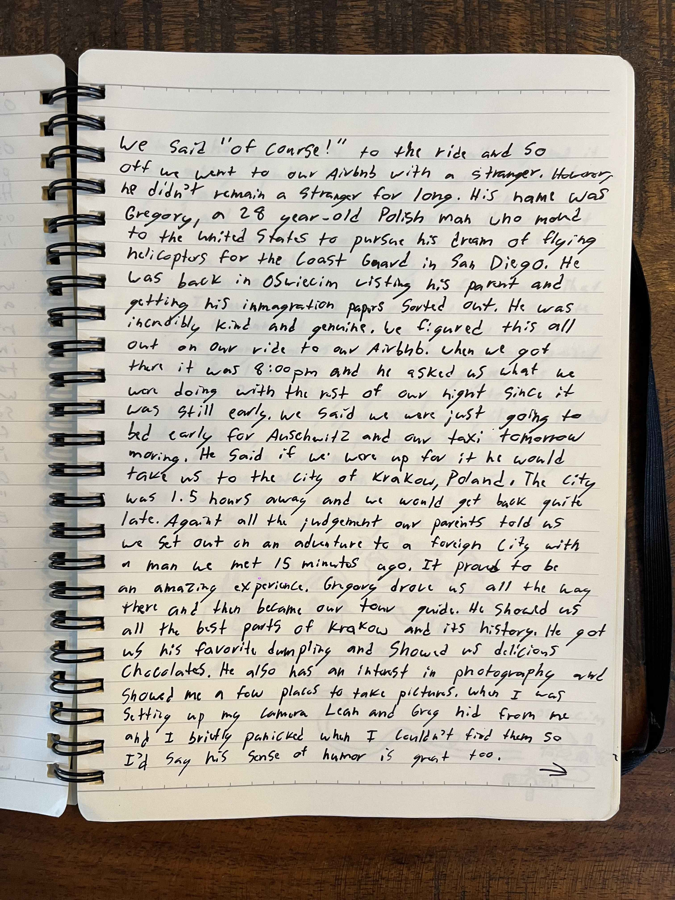
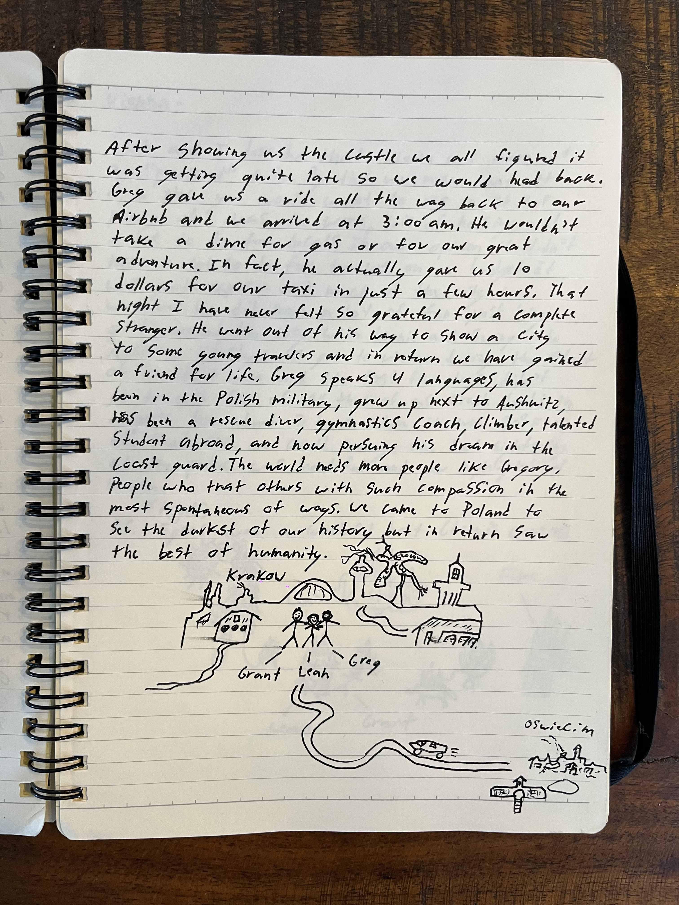

## Oswiecim, Poland

### Day 1

Oswiecim is home to perhaps the darkest place in all of human history, Auschwitz. However, our time in Oswiecim was one of the most spontaneous, positive, and up lifting adventure of our lives.

We rolled into Oswiecim station late afternoon after a long and sleepy train ride. We only had about 18 hours total in the small city of Oswiecim and we wanted to see as much of Auschwitz-Birkenau as we could. Auschwitz closed around 6:30pm so we decided to head over to the museum for a few hours so we weren't so rushed in the morning. If I could describe the concentration camp in one word it would be "evil". Perhaps the single most evil place on Earth. The moment you pass under the iron gate that so many souls crossed before you, there is a gut wrench feeling of human despair that transcends the time of the evils that took place at Auschwitz. Our stay here was short yet very meaningful before we headed back to the town for dinner. We took a taxi to dinner and even arranged a pickup for the following morning at 8am to get back to the camp (more on that later). We began to walk home after dinner when a man pulled up next to us in his car. He thought we looked lost and wanted to know if we needed directions or a ride. We said "of course!" to the ride and so off we went to our AirBnb with a stranger. However, he didn't remain a stranger for long. His name was Gregory, a 28 year-old Polish man who moved to the United States to pursue his dream of flying helicopters for the Coast Guard in San Diego. He was back in Oswiecim visiting his parents and getting his immigration papers sorted out. He was incredibly kind and genuine. We figured this all out on our ride to our AirBnb. When we got there it was 8:00pm and he asked us what we were doing with the rest of our night since it was still early. We said we were just going to bed early for Auschwitz and our taxi tomorrow morning. He said if we were up for it he would take us to the city of Krakow, Poland. The city was 1.5 hours away and we would get back quite late. Against all the judgement our parents told us we set out on an adventure to a foreign city with a man we met 15 minutes ago. It proved to be an amazing experience. Gregory drove us all the way there and then became our tour guide. He showed us all the best parts of Krakow and its history. He got us his favorite dumplings and showed us delicious chocolates. He also has an interest in photograph and showed me a few places to take pictures. When I was setting up my camera Leah and Greg hid from me and I briefly panicked when I couldn't find them so I'd say his sense of humor is great too.

After showing us the castle we all figured it was getting quite late so we would head back. Greg gave us a ride all the way back to our AirBnB and we arrived at 3:00am. He wouldn't take a dime for gas or for our great adventure. In fact, he actually gave us 10 dollars for our taxi in just a few hours. That night I have never felt so grateful for a complete stranger. He went out of his  way to show a city to some young travelers and in return we have gained a friend for life. Greg speaks 4 languages, has been in the Polish military, grew up next to Auschwitz, has been a rescue diver, gymnastics couch, climber, talented student abroad, and now pursing his dream in the US Coast Guard. The world needs more people like Gregory. People who treat others others with such compassion in the most spontaneous of ways. We came to Poland to see the darkest of our history but in return saw the best of humanity.

---

