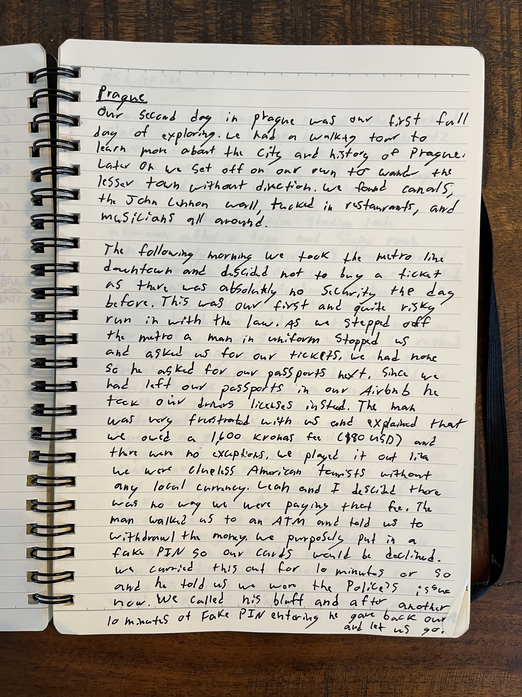

## Prague, Czech Republic

### Day 1

Still day 1 and we were on the train from Munich when we ran into some trouble. Somehow we managed to get off 1 stop too soon. We were tired, getting cranky, and now a very long way  from our AirBnb without a clue how to get there. Luckily, another couple who was on the train and lived in Prague over heard us. They gave us a ride in their car all the way to our place. They wouldn't even take a top. It was late so we got pizza and crashed into bed.

### Day 2

Our second day in Prague was our first full day of exploring. We had a walking tour to learn more about the city and history of Prague. Later on we set off on our own to wander the lesser town without direction. We found canals, the John Lennon wall, tucked in restaurants, and musicians all around.

The following morning we took the metro line downtown and decided not to buy a ticket as there was absolutely no security the day before. This was our first and quite risky run in with the law. As we stepped off the metro a man in uniform stopped us and asked us for our tickets. We had none so he asked for our passports next. Since we had left our passports in our AirBnb he took our driver's licenses instead. the man was very frustrated with us and explained that we owed a 1,600 krona fee ($80 USD) and there were no exceptions. We played it out like we were clueless American tourists without any local currency. Leah and I decided there was no way we were paying that fee. The man walked us to an ATM and told us to withdrawal the money. We purposely put in a fake PIN so our cards would be declined. We carried this out for 10 minutes or so and he told us we were the polices' issue now. We called his bluff and after another 10 minutes of fake PIN entering he gave back our driver's licenses and let us go.

---

